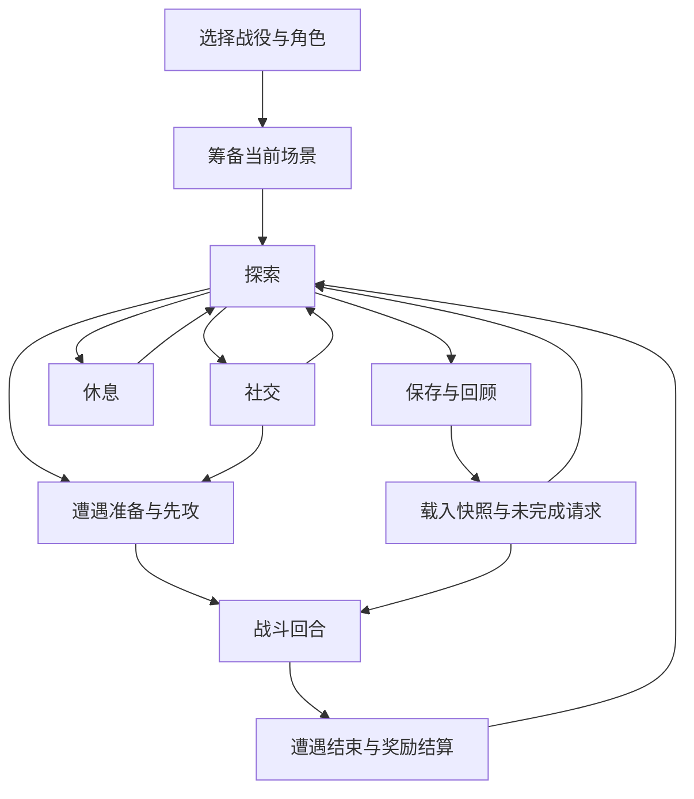
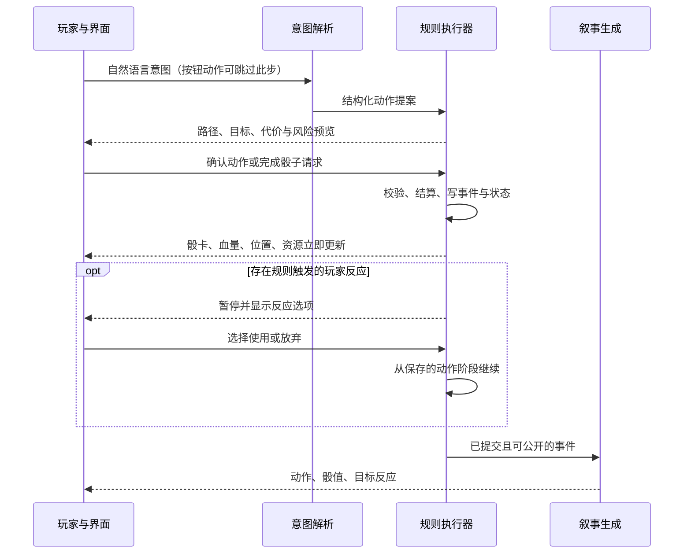

# AIDM 接入方案：规则执行器驱动流程，模型负责意图与叙事

日期：2026-09-12。基于当前 `0.8.0` 源码核查。配套交付：[完整提示词与当前可用短补充](AIDM_PROMPTS.md)。

**目标是接近《博德之门3》的操作流畅度，同时保留文字跑团的开放行动。**本方案借鉴动作预览、自动结算、反应暂停和连续敌方回合这些交互目标；规则基线仍为 D&D 5e 2014。具体游戏规则变体应作为显式规则配置，而不是让模型自行混用。

状态：本次仅新增设计文档和可复制提示词，未改动运行时、真实存档或 EXE。下文新增接口、目录、预算和验收指标均为待实现设计。

## 1. 当前项目已经具备的基础与实际缺口

核查以代码为准；`PROJECT_REVIEW.md` 的初始问题清单中有些能力已在后续版本完善。

| 当前落点 | 已有能力 | 本次方案应改什么 |
|---|---|---|
| `engine/ui-host.latest.txt` 的 `ai.chat`、`aiSystemPrompt` | Chat Completions 工具循环、工具白名单检查、供应商文本降级、pending 后暂停 | 抽出提示词装配、按阶段工具集、预算、执行后叙事与调用指标 |
| 同文件的 `buildToolSpecs` | core/all 工具集，附加 gameplay/campaign 工具 | 默认候选仍多；规划调用不应拿到任意 HP、经验和地图重置接口 |
| 同文件的 `getCampaignContext` | 读取已选模组、保留 PDF 页码来源 | 目前每次附上模组前4条，最多20,000字符；改按当前场景检索，避免长期反复发送开篇 |
| `src/campaign.mjs` 的 `dm.action` | roll、turn、free、move、target、area、town | 是交互路由器，尚不是完整 attack/cast/rest 事务执行器 |
| `src/gameplay.mjs` | 地图预览、待骰队列、玩家反馈后 `session.resume`、串行包装、检查点、HP同步、专注和效果 | 选择或投骰完成仍经常回模型；缺少完整动作续接计划、反应中断链与统一事务版本 |
| `scene.get` | 地图、角色法术清单、回合、近期骰子和待办 | 全量 map/法术加上状态摘要重复传输；需要按角色和可见性投影 |
| `party.sheet` / `slotsForClasses` | 法术清单与各环位上限 | 当前 `slots` 是由职业等级推导的容量，不能据此证明剩余法术位；需持久化 used/remaining 与恢复规则 |
| `campaign.resolve` | 按来源核查经验、奖励去重、角色写入收据 | 沿用；补目标达成事件、里程碑、战利品及内置/导入来源的统一引用 |
| `sessionFiles` / `session.save/restore` | 聊天与战役快照、战斗归档 | 补摘要覆盖事件游标、未完成动作、公开/秘密知识与恢复语义 |

静态只读统计：基础及 gameplay/campaign 固定提示词合计约 **3,000 JS 字符**；core 候选43个，加7个 gameplay、5个 campaign、1个法术读取，按目录预期约 **56个默认工具**；实际注册数量应在接入时从请求记录验证。每次还保留最近40条聊天、完整实时场景和开篇资料。以上是代码数量/字符上限，**不是 tokenizer 实测 token 数，也不是已测成本**。

当前 `dryRun` 只返回部分提示词，未覆盖实际附加的全部内容，不能直接用它作为成本基线。应捕获完整待发送请求的各段统计，不采集密钥和真实玩家私密日志。

## 2. 调整原稿中影响质量的约定

1. **三层提示词保留，另加权威状态。**提示词约束行为，程序状态决定已发生什么；工具描述和 schema 同样占输入 token，移位置本身不会节省。
2. **纠错先区分未执行与已执行。**未掷骰的“我一剑秒杀首领”应先建立攻击尝试，不能替它编造一次命中。无法执行的动作保持未提交；真实施法失败、已耗费资源等按实际规则处理。
3. **回合资源不能简化成每种只准一次。**动作可含多次攻击，特殊能力可能赋予额外动作；反应有独立触发窗口并在自身下回合开始恢复。短句交流可随回合进行；近战将目标打到0HP时也可能选择击昏。这些都是执行器职责。[2014战斗规则](https://www.dndbeyond.com/sources/dnd/basic-rules-2014/combat)
4. **施法校验应数据化。**环位、目标、施法时间、成分、专注和具体法术条文不可被一条通用提示替代；2014附赠动作施法对同回合其他施法有限制，不能只按“还有一个动作”裁定。[2014施法规则](https://www.dndbeyond.com/sources/dnd/basic-rules-2014/spellcasting)
5. **地图用于需要精确位置的过程。**范围、攻击、危险移动和效果必须通过几何系统；普通对话、远途叙事不必逐格点选。地图未校准地形时返回几何未知，不将图片上看似可走的区域认作已验证通路。
6. **进展由世界事件驱动。**不固定每3—4条消息塞遭遇，不把遇见敌人一律视为交战；达到需要先攻裁定的条件才进入战斗。HP/CR也不是说服、法术或瞬杀合法性的通用阈值，按具体能力条文检查。
7. **摘要记录知识，快照记录数值。**摘要中的传闻不变成事实，秘密不进入公开回顾；战斗结束不只判断敌方HP，还考虑投降、撤离、未结束的威胁与待处理事件。

## 3. 两个状态维度，防止模式互相覆盖

服务端维护叙事活动 `mode`，另维护动作流程 `flow`。用两维状态，避免“战斗中说话”切到社交后清掉先攻。



`mode = prepare | explore | social | combat | rest | resolve | recap`

`flow = idle | validating | awaiting_target | awaiting_roll | awaiting_reaction | resolving | narrating | awaiting_player | needs_rule | recoverable_error`

- 模式切换通过已验证事件提交，不由模型在正文写“切换战斗”就生效。
- 新地点触发场景更新和摘要；战斗追击换图须专门迁移回合，不能自动改探索。
- 先攻未收齐时不开放首回合。常规回合结束以玩家结束按钮/明确声明或引擎事件为准，不由聊天结束推断。
- 战斗中的对话使用 combat + 简短社交插件；反应是当前动作的中断，不能被“非当前行动者禁止操作”的通用检查拦掉。
- `awaiting_*` 只暂停依赖该输入的动作；同一角色/遭遇的竞争性变更禁止穿越。只读查询不受影响。
- 自由移动开关与遭遇生命周期分开；现在的 `combat.active` 同时影响移动方式，迁移时应保留兼容字段并引入 `encounter.status`，防止把 `suspended` 判成胜利。

持久化至少包含：`campaignId, sceneId, rulesetId, mode, flow, actorId, stateVersion, activeActionId, pendingId, lastCommittedEventId`。现有 `session.revision` 不是覆盖所有角色/地图/战役写入口的统一版本，不能直接视为全局并发保障。

## 4. 一次攻击只让 AI 做需要语言理解的部分

目标链路：



图中的结算可分阶段：每个规则反应窗口都插在其规定的时机，不能等全动作伤害提交后才统一询问。比如机会攻击应在离开触及前触发；护盾术等可能改变命中结论，必须在对应窗口解决。

一次普通近战攻击的目标体验：

1. 玩家点击攻击和目标；本地立即预览范围、路径与资源。自然语言输入才需要模型把“冲过去砍他”解析为提案。
2. 目标超出触及返回明确原因；若移动是可选方案，显示路径/机会攻击风险，让玩家确认移动与攻击的组合，不能擅自替玩家选。
3. 确认后由执行器保存动作计划，并建立玩家命中骰请求。玩家点骰后，执行器按规则判断命中，必要时直接衔接伤害骰和反应窗口。
4. 命中→伤害→抗性/临时HP→本体HP→专注/濒死等触发按规则阶段处理。无需在每两个步骤间问一次模型“接下来干什么”。
5. 界面立即显示已提交结果，再做一次简短叙事。AI网络故障时使用事件模板；状态与当前玩家操作无需等文案。

保留当前默认“玩家亲自点骰”。可增加用户主动启用的快速掷骰设置；它只是执行器代投与合并动画，不跳过规则、反应或其他玩家决定。动画不决定随机值。

## 5. 工具收敛为少量业务入口

以下为**新增目标接口**，当前不直接调用。底层仍可适配现有 op，逐步迁移。

| 目标接口 | 职责 |
|---|---|
| `context.get(scope, refs)` | 获取当前角色/场景的紧凑视图；scope固定枚举，避免总返回全图 |
| `knowledge.lookup(kind, ids, query)` | 规则、模组、怪物、法术按ID优先读取，搜索作为补充；返回来源与缺失字段 |
| `action.propose(intent)` | 规范化意图、静态验证并生成计划/待选项；缺目标时建交互，合法完整时交执行器 |
| `world.propose(change, evidence)` | 提议对话承诺、任务进度、物品归属或新场景事实；服务端按权限与类型验证后提交 |
| `encounter.control(operation)` | 准备/开始/结束遭遇的受约束入口，核实先攻、未完成动作与结束条件 |
| `reward.resolve(objectiveId, evidence)` | 奖励与升级进度，复用现有去重账本 |

叙事调用不带写工具；休息、施法、检定等通过动作类型的按需协议加载。新增 `action.preview/commit/resume` 为执行器与UI内部接口，不需要全都暴露给模型。长期可以保留 `dm.action` 名称作为兼容路由，不能把旧枚举静默扩展后忽略旧语义。

模型提交动作只需 `actorId, kind, abilityId, targetIds, destination, options` 等意图字段。**伤害值、命中修正、DC、消耗、可用次数由引擎依据规则计算**。`actionId, requestId, expectedVersion` 等由服务端生成或绑定，不要求模型自行发明。

工具描述统一包含：用途、输入约束、可用流程、是否写状态、返回的 pending/结果、失败与重试语义。使用本次白名单和服务端参数验证；模型 schema 不能替代动作是否合法的验证。

原生 function calling 优先。支持严格 schema 的供应商可开启严格模式；OpenAI 的严格模式要求对象禁止额外属性、字段列为 required，可选值用 nullable 等兼容形式表达，不能给现有松散 schema 直接加一个开关。[Function calling 官方文档](https://developers.openai.com/api/docs/guides/function-calling)

现有不支持 tools 的接口保留 `dm-action` 围栏，并只注入当前动作对应的精简格式。解析后同样进入校验器；不新增 `[TOOL: xxx]`，不接受正文中的“已执行”作为回执。

## 6. 原子结算、反应和失败恢复

不要只把 `roll.dice → combat.damage → combat.economy` 包装成一次函数调用就称为完成。需要处理以下契约：

- **统一实体状态**：HP、资源、效果与位置有规范实体ID；地图、角色卡、先攻面板作为投影同步，旧数据先做一致性校验。读状态、预览与提交使用统一版本。
- **预检不消费**：预览无写入、无随机数；提交前核实角色、目标、几何、可用资源、规则版本与是否当前回合。找不到法术剩余量返回未知，不能用容量当余额。
- **分阶段提交**：将一次行为保存为可恢复计划；每个不可分割的结算阶段一次提交状态和事件。移动遇到反应时，之前已走过的格子可以已经生效，不能承诺整个移动攻击组合永远全回滚。
- **规则规定的消耗时机**：预留资源防止并发使用；到施法/行动发生阶段按规则扣除。已公开骰值、已花费且规则不返还的法术位不能因后续文案失败而回滚。
- **幂等与重试**：同一个UI动作ID、骰请求ID、反应请求ID只执行一次；重复提交返回原回执。骰值在首次执行后持久化，网络重试不得重掷。同一动作内的新攻击有新子事件ID。
- **持久化机制**：建议先做统一命令队列和写前日志/事件日志，提交规范快照后再更新兼容投影。多份JSON各自原子替换不等于跨文件事务；崩溃后按提交标记恢复投影。奖励和 gameplay 的各自串行队列要纳入同一权威写入路径。
- **反应栈**：保存触发事件、可反应实体、合法能力、原动作继续位置。反应消费与下一回合恢复由引擎管理；默认等待玩家选择，不使用现实超时偷偷选“放弃”。
- **失败分类**：无效输入、状态过期、缺少规则、等待玩家、已执行但投影未更新、供应商失败分别返回。工具失败时模型不能继续叙述成功；已提交状态的文案失败只重试文案。

规范回执示例（新增协议；数值只是示意）：

```json
{
  "ok": true,
  "actionId": "a-104",
  "status": "awaiting_reaction",
  "versionBefore": 82,
  "versionAfter": 83,
  "committedEventIds": ["ev-301"],
  "pending": {"id": "q-22", "kind": "reaction", "actorId": "pc-1"},
  "publicEvents": [{"id": "ev-301", "type": "attack_declared", "actorId": "goblin-2", "targetId": "pc-1"}],
  "next": "wait_player"
}
```

完整原始骰值、规则依据与秘密结果留在服务端事件日志。返回给公开叙事的投影不能带未发现敌人、暗骰、隐藏DC和DM秘密；工具错误和候选行动也要遵守同样的可见性规则。

## 7. 自由叙事如何改变世界

叙事分三级，避免所有内容都停留在聊天里：

| 类型 | 示例 | 处理 |
|---|---|---|
| 气氛描述 | 潮湿石壁、说话停顿、火把摇晃 | 可即时生成；不改变机械状态，不构成无来源线索 |
| 持久世界事实 | 商人接受订金、村民答应带路、门已打开 | `world.propose` 提交类型化事件，关联场景/NPC/来源，成功后叙事 |
| 机械效果 | 推倒、击退、烧断绳索、法术控制 | 映射到已有规则动作；缺机制时明确临时裁定和代价，经执行器验证后执行 |

允许模组未写的普通生活细节与合理互动，但不得把即兴NPC台词升级为新官方剧情或改写已建立的事实。临时裁定需要保存范围与依据；不必每次询问玩家所有无害细节，涉及额外风险、资源或不同意图时让玩家选择。

NPC卡最少包括 `id, sourceIds, identity, goals, fears, knowledge, attitude, commitments, tactics, morale, unknowns`。动机与怪物数值分开。策略层使用可知目标与合法候选动作：普通敌人优先本地策略，首领阶段或复杂谈判才询问模型；模型不能返回任意HP修改。

连续敌方回合可以连续执行、合并短叙事，但每个规则时机、玩家反应和新信息节点都能打断；不能因合并而让所有敌人同时攻击。

## 8. 上下文与 token 预算

请求按稳定程度排列：固定身份/契约与稳定工具 → 当前模式 → 当前场景资料与摘要 → 本次状态/事件 → 必要的近期对话和玩家输入。

缓存依赖可复用的相同前缀。固定内容在前、动态内容在后，并保持工具顺序/schema稳定；按模式删工具与保持缓存可能有取舍。先采用小核心加模式工具包，再以供应商实际用量比较。部分OpenAI接口支持保持工具列表并限制可调用子集，不能假定本项目所有兼容接口均支持；缓存也不消除上下文占用。[Prompt caching 官方文档](https://developers.openai.com/api/docs/guides/prompt-caching)

应用侧应先做以下压缩，不依赖供应商缓存：

1. **少调用**：按钮动作不走意图模型；投骰/选目标反馈直接续接动作计划；不为排序、扣资源、判胜负调用模型。
2. **少工具**：模型只拿本阶段的业务工具；叙事阶段不给写工具。避免将几十个低层op全部发送。
3. **少状态**：发送当前行动者、相关目标、剩余资源、pending与近期事件；地图用局部实体/几何结果表达，地形矩阵保留本地。只保留一个权威视图，删除重复状态字符串。
4. **少资料**：以 `moduleId + sceneId + entryId + contentHash` 缓存当前场景资料；怪物能力按ID读取一次，后续状态只传实例差异。未知规则精确检索，不附整本书或固定开篇。
5. **少历史**：以token预算保留最近相关对话，通常先从4—8条开始调优；摘要覆盖较早事件，待办、承诺和未解决线索不可因为“太旧”被裁掉。
6. **完整而短的结果**：工具返回有界JSON、字段投影和分页。不要截取JSON字符串塞入excerpt后期待模型可靠恢复；含 sourceId、缺失字段、下一页游标和版本。
7. **摘要按需要生成**：场景切换或预算接近阈值时压缩，聚合事件而非每条消息调一次模型；保留原日志及摘要覆盖游标。重要事实和未完成动作由程序合并，模型负责语言压缩。

首轮可配置预算目标（含输入中的提示词、工具定义、资料和对话；不是实测承诺）：

| 调用 | 输入预算初值 | 模型调用目标 |
|---|---|---|
| 标准按钮战斗动作 | 模型无需读取动作预览；叙事请求约1,500—3,000 tokens | 执行0次，完成后的叙事0—1次 |
| 自然语言战斗动作 | 规划约2,000—4,000 tokens，叙事单独紧凑输入 | 通常1次意图解析 + 0—1次叙事；规则缺失时允许额外检索 |
| 探索/社交 | 约3,000—6,000 tokens | 通常1次；有状态写入时按需工具续接 |
| 场景摘要 | 按未压缩事件量有界分段 | 场景切换/阈值触发 |

先测现用模型和供应商，不固定推荐某个型号，也不承诺省80%。记录每次完整请求的 `input/output/cached tokens`（供应商缺失则明确标记估算）、LLM往返数、首个状态反馈延迟、叙事延迟、完整行动时长与每个完成行动的成本。中文字符数不能直接当token数。

## 9. 分阶段嵌入现有代码

### P0：替换提示词装配并建立基线

- 在 `src/ai/` 新增 `prompts.mjs, context.mjs, toolsets.mjs, telemetry.mjs`，由 `server.mjs` 注入引擎；渐进替换三处硬编码提示词，保持现有op兼容。
- 按已存在的 prepare/free/turn/pending 映射安全的活动模式；尚未持久化的社交/休息模式不靠关键词直接改战斗状态。
- `getCampaignContext` 改按当前场景来源检索；首次筹备才需要开篇。精确统计完整请求，补真正覆盖实时场景与工具集的dryRun。
- 保持玩家默认手动点骰、已有PDF地图、战斗归档与奖励账本行为。
- 验收：相同事实输入下无重复模式、无遗漏待办、无剧情泄露；取得基线成本和延迟数据。此阶段不能宣称完整自动战斗。

### P1：先打通一个可靠的战斗闭环

- 在 `src/domain/actions/` 建立 `validate, resolve, reactions` 和资源状态；统一实体/版本、幂等、事件提交与恢复。
- 优先完整实现普通近战/远程攻击、移动、机会攻击、结束回合、死亡/稳定流程，以及一组经核实的法术；每项列支持范围和缺口。
- 旧 `interaction.answer`、`dice.answer` 完成后优先续接引擎动作，只有开放问题或最终叙事才调用 `session.resume` 中的AI路径。
- 把回合按钮、目标预览和事件卡接到同一个动作入口；释放文案与动画对下一次操作的阻塞。
- 验收：一个玩家与两个地精从先攻到结束，含一次非法目标、反应、伤害、倒地、奖励及中途重启；不需要人工代改HP/回合来续接。

### P2：补齐完整冒险生命周期

- 社交承诺/态度、调查线索、场景切换、NPC知识、物品与任务事件持久化。
- 短/长休的时间、生命骰、资源恢复和中断；按职业与法术特性补规则覆盖。
- 统一导入与内置模组来源；保留当前经验去重，增加里程碑、战利品与玩家升级选择。
- 公开/秘密分层记忆与摘要压缩、载入未完成请求、一次游戏结束后的回顾。
- 验收：开场探索→社交获得线索→遭遇→非战斗/战斗解决→奖励→休息→存档→重启续玩，知识与资源保持一致。

### P3：优化手感与成本

- NPC候选策略、连续敌方回合、事件模板降级、流式叙事、局部上下文、供应商能力探测与缓存测量。
- 实测后决定是否增加轻量意图模型；先避免多模型/多代理引入额外往返。
- 每阶段按项目流程进行隔离行为测试，涉及界面时再运行 `smoke-ui.mjs` 和实际点击流程，通过后重封装发布；设计文档变更不需要重打EXE。

## 10. 验收集与效果判断

使用临时目录、合成角色/地图和可控骰子注入；不读写真实战役。录制标准动作和事件回放，固定规则版本。必要场景如下：

| 场景 | 必须成立的结果 |
|---|---|
| 15尺外用5尺触及武器攻击 | 返回不可执行；无伤害、无骰子、无资源消耗，提供可选移动 |
| 攻击未命中/多次攻击 | 不扣目标HP；一次动作内的可用攻击次数正确，不能只按动作布尔值判断 |
| 重试同一动作或投骰 | 返回同一回执/骰值，不重复扣血、法术位或发经验 |
| 已确认目标后地图或回合变化 | 提交因版本过期被拒并刷新预览，不能攻击旧位置 |
| 离开触及、脱离、反应已用 | 在正确移动阶段处理机会攻击；不重复反应，不把所有移动都视为触发 |
| 攻击引发可改变结果的反应 | 玩家选择前停住相关结算；响应后恢复原动作，无回合错位 |
| 法术位不足/附赠动作施法 | 引擎拒绝不合法组合；资料缺失标未知，不由模型补余额 |
| 临时HP、抗性、专注、持续效果 | 按具体规则来源与触发时机计算，预览不重掷，重复回执不再次生效 |
| 0HP、死亡豁免、击昏 | 依据规则与已选意图进入相应状态；不是简单“所有0HP都死亡” |
| 敌人逃跑/投降、切自由移动 | 遭遇状态与目标是否解决分开，不能重复/过早结算奖励 |
| 查不到模组或怪物条目 | 清楚指出缺失；不伪造数值、奖励与官方剧情 |
| 秘密敌人/暗骰/NPC谎言 | 不出现在公开工具投影、提示选项、叙事或玩家摘要 |
| 摘要压缩与程序重启 | 目标、承诺、未完成请求与已提交事件不丢；不重掷、重开先攻、重发奖励 |
| 写入中断/模型断线 | 恢复已提交状态和投影；状态提交成功但文案失败只重试文案 |

性能目标需在目标电脑和供应商上测量：先以本地预览/已提交状态反馈 p95 <200ms 为优化目标；网络叙事延迟独立记录。对比同一组动作优化前后的输入token、LLM往返数、完整行动耗时及规则错误率，不能只看提示词字数。模型评测应检查“未执行先报成功、秘密泄露、替玩家做决定、重复请求”等失败，并对探索/社交文本做人工质量抽查。

第一优先级是**一次合法动作能够可靠、快速、可恢复地执行到底**。模块化提示词帮助模型理解当前任务；动作执行器和事件驱动界面决定战斗是否流畅。
